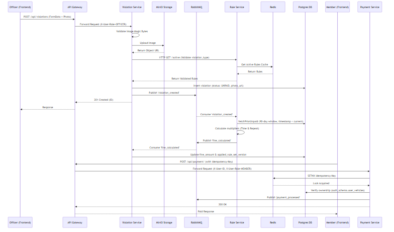
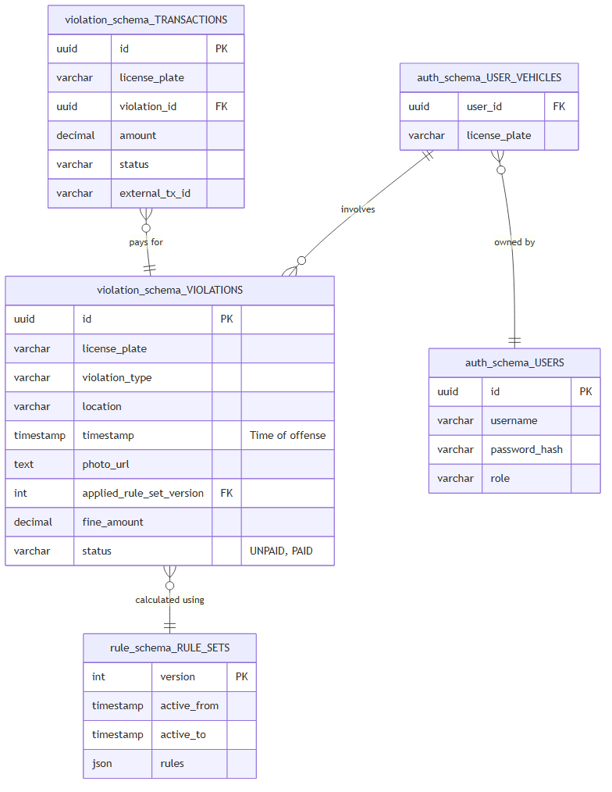

# Parking Violation Portal - System Design

## 1. Architecture Overview

The system consists of a microservices architecture communicating via an API Gateway, with internal synchronous calls and asynchronous event streams via RabbitMQ.

### Key Components:
- **API Gateway (Port 8085)**: Routes external traffic to internal microservices, handles CORS, validates JWTs, and securely injects `X-User-ID` and `X-User-Role` headers downstream.
- **Frontend (Nginx - Port 80)**: React/Vite Single Page Application. Strict adherence to `Asia/Jakarta` timezone formatting for precise temporal derivations.
- **Auth Service**: Handles JWT token issuance and user authentication.
- **Violation Service**: Receives violation submissions, validates file Magic Bytes to prevent spoofing, uploads images to **MinIO (S3-Compatible Storage)**, returning Presigned URLs, stores records, and publishes events.
- **Rule Service**: Manages active rule versions and caches them in Redis. Computes complex fines asynchronously based on chronologically ordered prior offenses.
- **Payment Service**: Processes fine payments using Redis-backed Idempotency Keys to prevent duplicate transactions and strictly verifies vehicle ownership.

## 2. Core Engineering Decisions & Rules Engine

A critical design choice is that the repeat violation multiplier is based strictly on the **actual time of the offense** (`timestamp`), rather than the time the system ingested the record (`created_at`). 

- **Chronological Sequencing**: When the `violation_created` event is fired, the Rule Engine queries the database for unpaid violations strictly where `timestamp < current_violation_timestamp`. 
- **Timezone Synchronization**: Both the Go backend and the React frontend are strictly locked to `Asia/Jakarta` time. This guarantees that time-of-day multipliers (e.g., Nighttime 1.5x) are evaluated identically on both ends, preventing UI miscalculations.
- **Rule Set Tracking**: The `applied_rule_set_version` is tracked against each violation to guarantee immutability of calculations when rules are updated.
- **Idempotency**: The Payment Service uses `SETNX` in Redis to ensure that network retries or double-clicks on the frontend do not result in double charging.
- **Stateless File Storage**: Images are stored in MinIO rather than the local filesystem, ensuring the API remains stateless and ready for horizontal scaling.
- **Authorization**: Vehicle ownership is explicitly tracked via `auth_schema.user_vehicles` (1:N mapping). Services actively cross-reference Gateway-injected headers to restrict payment and history viewing exclusively to authorized owners.

## 3. Data Flow

## 4. Entity Relationship Diagram (ERD)

The database enforces schema separation per bounded context (`auth_schema`, `rule_schema`, `violation_schema`), avoiding the overhead of multiple Postgres containers locally while preserving microservice principles.

